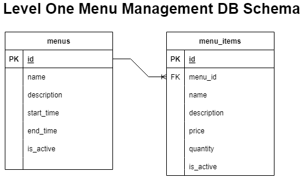

# Internal Architecture

## General Info

This document contains all information pertaining to database schemas, decisions made throughout the assignment and why, technologies used, functionality and general thought processes. 

## Table of Contents
* [Languages and Technologies](#languages-and-technologies)
* [Level One: Basics](#level-one-basics)
* [Level Two: Multiple Menus](#level-two-multiple-menus)
* [Level Three: JSON Consumption](#level-three-json-consumption)

## Languages and Technologies
This project is created with:
* Ruby 3.0.0
* Rails 7.0.3

Database:
* PG 1.3

Testing:
* Factory_Bot_Rails 6.2
* rSpec-Rails 6.0.0.rc1
* Shoulda-Matchers 5.1
* SimpleCov 0.12.0

Linting:
* Rubocop 1.30
* Rubocop-Rails 2.14
* Rubocop-rSpec 2.11

Security:
* Brakeman 5.2
* Bundler-Audit 0.9.1
* Figaro 1.2
* Ruby_Audit 2.1

Error Monitoring and Notifier:
* Airbrake 13.0

# Level One: Basics

The tasks given for level one were to create an Object Model for `Menu` and `MenuItem` classes. `Menu` has many `MenuItem`s and both have typical data associated with restaurants. All behaviour in this level is illustrated via validation and association unit tests using rSpec.

## Database Schema



For the `Menu` Table I added some of the fields I thought would be most commonly used. 'Start_time' and 'End_time' are optional fields for time-limited menus such as breakfast, lunch and dinner. 'Is_active' was added incase certain menus were no longer used or became unavailable. I thought about adding a 'category' field and including a table for commonly used menu types but decided to keep it out to stay as close to the requirements of the assignment as possible.

For the `MenuItem`s table, most of the fields are self-explanatory. I added an optional 'quantity' field incase menus wanted to have multiple options such as 2 spring rolls for a certain price, while 3 would be priced at a deal. 

## CI/CD with Automated Testing

For this assignment, I wanted to try my best to recreate a production level application, so I implimented CI/CD using Github Actions. Checks include automated testing, lint checks, security vulnerability checks(Brakeman and Ruby_Audit) and patch-level verification for bundler(Bundler-Audit).

## Error Monitoring and Alerting

I set up Airbrake to record and alert any errors to me via email that may occur while the app is running. Slack and other integratons are available upon request. It will be more useful once endpoints are created and app is hosted on Heroku. This is a snapshot of the dashboard for this project's monitoring.


# Level Two: Multiple Menus

The tasks given for level two were to introduce a `Restaurant` model, and allow `Restaurant`s to have multiple `Menu`s. A few other requirements were to have `MenuItem` names not be duplicated in the database and `MenuItem`s can be on multiple `Menu`s of a `Restaurant`

## Database Schema


Since there were a few changes to the requirements, I needed to change around the schemas and tables a little bit. I added the `Restaurant` table with most of the data that would be associated with it. I considered creating a category table for normalization but kept it to the scope of the level's requirements. 

`Menu` was given a `restuarant_id` field for a one-to-many relationship. This is where I came to a crossroad with my development of this assignment. The requirement to make `MenuItem` names unique was a challenge that required a few more tables. I considered a few cases for the requirement and possible solutions:

1. Duplicate names on the same menu - This would just be fixed via making sure the `MenuItem` didnt exist within the same menu. This seemed like a good edge case to look out for but not a solution to the problem.

2. Duplicate names and other fields across different menus of the same restaurant (A duplicate `MenuItem`). This seemed to be more closely related to what the problem was talking about. The only problem I saw with this would be that the `MenuItem`s name could technically be repeated elsewhere in the database(ex. Two restaurants having a Legendary Burger). The problem required a solution that would account for same-restuarant items but also across other restaurants.

3. Duplicate names across the ENTIRE database. Since the assignment stated that `MenuItem` names should not be repeated in the database, I took it at face value and decided to normalize food item names with a new table, `ItemNames`.

I changed the `MenuItem` table to a join table for the new `Item` table. This was to accomodate the restriction and requirements of the level. The `Item` table basically inherited all the old fields of `MenuItem` and were removed from the `MenuItem` table. The final piece was to make the name table- `ItemNames`. Now this database schema could handle slightly different items as well as the same items being used within both the same restaurant, and not having overlap with other restaurants.

## Code Coverage

Since the project was starting to grow with more tests being created, I decided to impliment the gem 'SimpleCov' to produce a simple code-coverage report after tests are ran.

# Level Three: JSON Consumption

The tasks given for level three were to convert a JSON body into the new system, and to make any changes to the models I designed to make the import as complete as possible. Output for the JSON would be a list of logs for each restaurant's menu items being added, with success or fail statuses.

## JSON Format

The format accepted by this API by the POST /restaurant is as follows:

```json
{
    "restaurants": [
        {
            "name": "Fried Chicken 24/7",
            "menus": [
                {
                    "name": "Lunch",
                    "menu_items": [
                        {
                            "name": "Chicken",
                            "price": 9.00
                        },
                        {
                            "name": "Chicken Nuggets",
                            "price": 7.99
                        }
                    ],
                    "name": "Dinner",
                    "menu_items": [
                        {
                            "name": "Extra crispy Chicken",
                            "price": 13.99
                        },
                        {
                            "name": "Spicy Chicken",
                            "price": 4.99
                        }
                    ]
                }
            ]
        }
    ]
}
```

The API accepts nested nestaurants, menus and menu_items.

## Database Schema

The database schema I created from level two was adequate for the tasks of level three. No modifations were made to the tables aside from a couple validation changes. 

## Assumptions Made

I weighed a couple options for how I wanted this API to consume the JSON. The two I came up with were a seed file and an endpoint. Since the level requirement stated a json 'BODY' I decided to go with a POST endpoint. This seemed like the better option because it would be more accessible to customers. 

Since there was no user table to go with the assignment, we can assume that authorization isn't necessary. On a production environment though, it would absolutely be necessary for most endpoints the API could have. 

As for how I handled the JSON, I would have liked to use nested attributes for a cleaner controller and to utilize the magic/power of Active Record. It seems like it would work extremely well in this use-case. The JSON though did not include _attributes on its nested fields, so I went with a more direct approach with inserting rows as I traversed the JSON rather than changing the structure of the JSON.

I believe the toughest part of this assignment was considering the edge cases while inserting the JSON. Primarily where the menu_item names duplicates happened. This is the flow chart I created prior to working on the API. 


A few other edge cases that I considered to be out of scope of the project were

* Chain restaurants and how their menus are handled
* Different types of currency for restaurants outside of the US
* Authorization for malicious intent checks
* Repeated menus within a restaurant and updating already-created ones
* Endpoints to grab full restaurant data (Entire restaurant -> item datasets)
* Endpoints to insert at different points of the db schema rather than just the top level

## Goals I wanted to achieve if I had more time

* Heroku hosting with easy commands to deploy to all environments with my built-in CI/CD pipeline
* Since the API was being built during the last level, I didn't go through with creating a Dev/Staging/Prod environment
* The concept of chaos engineering testing is super interesting to me and I would have loved to learn how to impliment it for this API
* More testing. I definitely rushed through level three a bit and I acknowledge there are pieces that I'd want to refactor and work on more
* Integration tests for the full flow rather than just unit tests
* Created a better formated response object that accounted for more edge cases
* Create an evidence of testing document to cover methods used, manual testing, test protocols and future goals

If you have any questions feel free to send an email to ThomasBogdanov1@gmail.com!